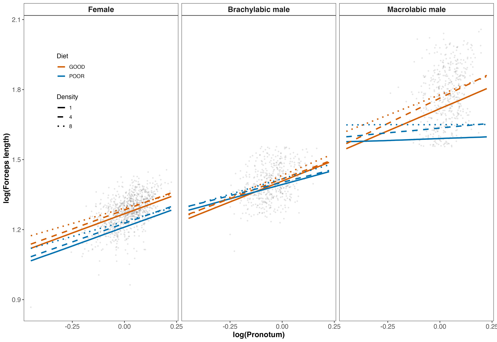
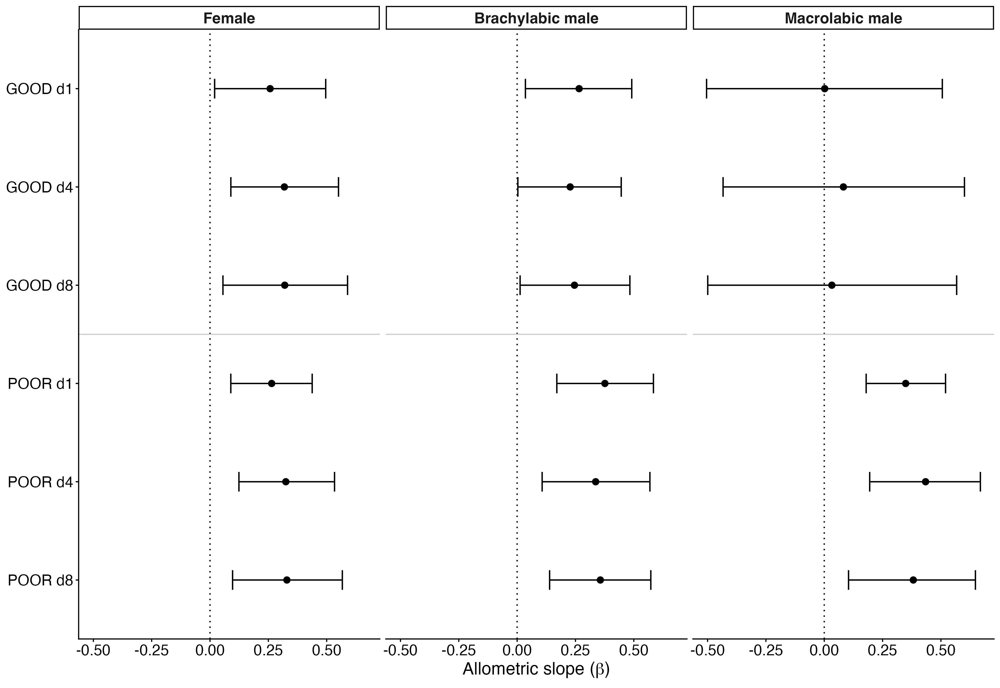
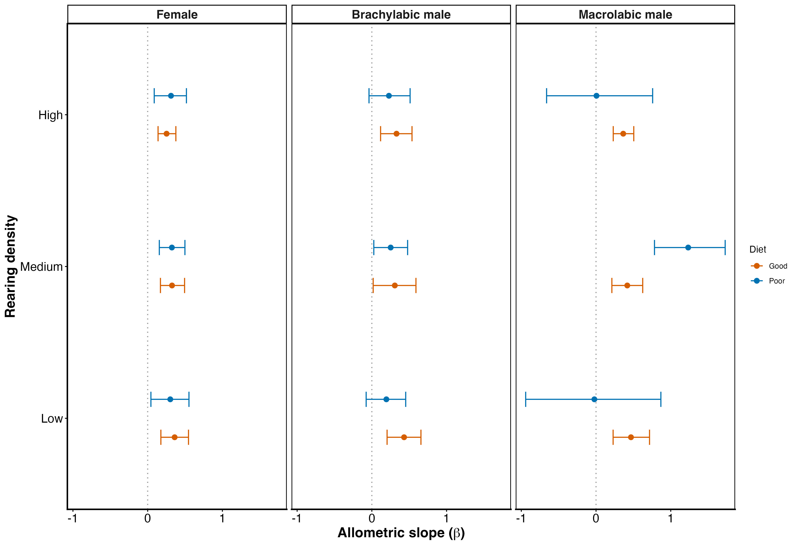

```{r echo=FALSE}
knitr::read_chunk('scripts/2026_earwig_allometry.R')
```

```{r analysis, include=FALSE,echo=FALSE, warning=FALSE, results="hide"}
```

\newpage

# Abstract
Static allometries are often treated as stable descriptors of morphological architecture, yet scaling relationships themselves may evolve and respond plastically to environmental conditions. We quantified sex- and morph-specific weapon allometries in the European earwig (*Forficula auricularia*) under experimental manipulation of developmental diet and density using hierarchical models that allow scaling exponents to vary across biological levels. Forceps length scaled positively with body size in all groups, but males exhibited substantially steeper allometric slopes than females. Nutritional stress reduced male scaling exponents, whereas density had little consistent effect on slopes. Female scaling relationships remained comparatively stable across environments. Among males, macrolabic individuals showed the strongest condition dependence, with steep slopes under favourable conditions that were reduced under poor diet, while brachylabic males exhibited more moderate and environmentally insensitive scaling. There was little evidence that environmental or morph-specific differences were driven by intercept shifts independent of body size. Among-family variation in slopes and intercepts was modest, and their covariance was weak and uncertain. These results show that weapon allometry is structured primarily through variation in scaling exponents and that slopes are condition-dependent components of exaggerated trait architecture.

\newpage

# Introduction
Static allometry describes how trait size scales with body size among individuals at the same developmental stage and provides a central framework for understanding the evolution of exaggerated morphology. Sexually selected weapons often exhibit positive allometry, such that larger individuals invest disproportionately more in trait size [@voje2016; @kodric-brown2006; @bonduriansky2007]. However, hyperallometry is not universal. When traits serve dual sexual and viability functions, or when functional and mechanical constraints limit disproportionate investment, isometry or hypoallometry may evolve instead [@bonduriansky2003; @eberhard2018; @kelly2025a]. Consequently, the scaling relationship itself reflects how developmental allocation, functional performance, and selection interact to shape trait architecture.

Static allometry is typically described by a linear relationship between log-transformed trait size and body size. In this framework, the slope (scaling exponent) describes how strongly trait size changes with body size (i.e., size-dependent exaggeration), whereas the intercept (elevation) represents expected trait size at the mean body size (given that body size is centred). Static allometry can therefore diverge through changes in either parameter. Differences in scaling exponent reflect variation in how strongly a trait responds to body size, whereas intercept divergence reflects differences in baseline trait expression at a given body size. These components need not evolve together [@lande1980; @cheverud1982; @pelabon2014]. Sexual dimorphism, for example, may arise because males and females differ in scaling sensitivity, in baseline allocation, or in both. Similarly, alternative male morphs may diverge through elevation shifts while retaining similar scaling exponents, or through fundamentally different scaling architectures [@tomkins2005a]. Distinguishing between slope-based and intercept-based divergence is therefore essential for understanding how exaggerated traits evolve [@voje2016; @pelabon2014; @bonduriansky2007; @shingleton2013].

Species expressing alternative reproductive phenotypes provide particularly valuable models for examining the structure of allometry. In these species, males adopt discrete morphs that differ in weapon size, behaviour, and mating tactics [@gross1996; @shuster2003; @oliveira2008]. Because morphs share much of their genome and developmental environment, differences in scaling architecture can reveal how developmental pathways partition exaggeration within a single species. However, empirical analyses of morph-specific static allometry remain scarce, and even fewer studies have investigated how environmental factors influence both slopes and intercepts in polymorphic systems [@kochensparger2024;@kelly2025a].

Environmental conditions can influence developmental allocation and consequently reshape static allometries [@emlen1997; @frankino2005; @shingleton2007]. Nutritional stress may decrease baseline investment in exaggerated traits, lowering intercepts, whereas social factors such as rearing density could alter competitive allocation patterns. Environmental effects on scaling exponents would indicate plasticity in the trait–body size relationship, whereas consistent slopes across environments would imply canalisation of scaling architecture [@frankino2005; @shingleton2007; @nijhout2012]. Determining whether environmental variation modifies intercepts, slopes, or both is therefore crucial for evaluating the developmental flexibility of trait exaggeration. Complementary structural modelling of the same study system demonstrates that environmental effects on forceps size are transmitted both indirectly via body size and directly through trait-specific allocation, particularly in males [@ozkansubmitted].

Beyond sex, morph, and environment, variation among maternal families of related individuals offers insights into the integration of scaling architecture. Intercept and slope may covary across lineages if developmental processes jointly regulate baseline allocation and scaling sensitivity [@lande1980; @pelabon2014; @hansen2008; @klingenberg2008]. A positive intercept–slope covariance indicates that families producing relatively larger weapons at average body size also have steeper scaling relationships, reflecting integrated exaggeration architecture [@bonduriansky2003; @pelabon2014; @hansen2008]. Conversely, independence between parameters suggests modularity or developmental decoupling of baseline exaggeration and scaling sensitivity.

The European earwig (Forficula auricularia) provides a powerful system for integrating these perspectives on static allometry. Males express discrete forceps morphs that vary considerably in size and curvature, commonly referred to as macrolabic and brachylabic forms [@simmons1996; @tomkins2005a; @fig-one]. Forceps function both as sexual weapons during male–male interactions and as defensive structures, making them traits with dual roles [@meunier2024; @kamimura2014]. Previous work has documented morph-specific differences in forceps exaggeration and scaling, suggesting that divergence occurs not only in absolute size but also potentially in scaling architecture. Nonetheless, most studies have primarily compared static slopes, with less attention to intercept divergence, environmental sensitivity of scaling parameters, and variation among families.

Here, we quantify sex-specific and morph-specific static allometries of forceps length in F. auricularia under experimentally manipulated diet and density. Rather than treating the scaling exponent as fixed, we test whether it functions as a condition-sensitive developmental parameter structured across biological levels. Specifically, we investigate whether sexual dimorphism in weapon exaggeration results from divergence in the scaling exponent, intercept, or both; whether macrolabic and brachylabic males differ mainly in baseline allocation or in the sensitivity of forceps growth to body size; and whether larval environmental conditions influence intercepts, slopes, or their covariance. Finally, by estimating variance among families in intercepts and scaling exponents, we determine whether baseline exaggeration and size sensitivity are developmentally integrated. Through integrating sex, morph, environment, and family components within a unified hierarchical framework, we assess whether static allometry is a stable architectural constant or an emergent property of layered growth regulation [see also @simmons1996; @tomkins2005a; @kelly2025a].

# Methods

### Study species and experimental design
Females (n = 115) were hand-collected at night from vegetation in Parc Outremont (Montréal, QC, Canada) during September and October 2024. Individuals were transported to the laboratory at the Université du Québec à Montréal and placed individually in 90-mm Petri dishes filled with moist sand. Each dish was provisioned with a cotton-plugged water tube, and TetraMin Tropical Flakes (United Pet Group, Inc., Germany), and each female was assigned a unique ID code. Earwigs were maintained in the dark at 10 °C in an incubator (Percival Scientific, Perry, IA, USA) to mimic overwintering conditions. Dishes were checked daily for egg laying, and food and water were replenished as needed. Food and water were removed at the time of egg laying (approximately early December), after which dishes were checked weekly. Starting January 2025, dishes were checked daily for egg hatching. The date of egg hatching was recorded; hatching occurred between 13 January and 29 January 2025, and all 115 females produced hatchlings.

For two weeks following hatching, families were provisioned with a water tube and food (TetraMin Tropical Flakes). This interval allowed nymphs to complete a moult and reach a size sufficient to withstand manual transfer to experimental dishes. To manipulate the developmental environment, we varied two ecological factors: nutritional condition (diet quality) and social density. Diet treatment consisted of two levels: a “good” diet (100% TetraMin Tropical Flakes), providing high nutritional quality, and a “poor” diet (75% TetraMin Tropical Flakes, 25% alpha-cellulose), providing reduced nutritional content. Density treatment consisted of three levels: low density (one individual per Petri dish), medium density (4 individuals), and high density (8 individuals). These treatments allowed us to examine both nutritional and social environmental effects on growth and morphology. We used a split-brood experimental design in which offspring were randomly assigned to diet and density treatments within maternal families to minimise confounding between maternal background and environmental treatment. Experimental dishes were maintained at 20 °C to mimic post-winter developmental conditions and contained a water tube, treatment-specific food, and a refuge (four small pieces of paper straw glued together). A total of 1,265 Petri dishes were prepared. Females (mothers) were euthanized by freezing at −20 °C after offspring had been assigned to treatments. Dishes were checked several times per week for mortality and sexual maturation, and food and water were replenished as needed.

### Morphological measurements
Once offspring eclosed to adulthood, they were removed from their Petri dish, the date recorded, and assigned a unique ID code. Pronotum width (a proxy for overall body size) and forceps length [following @vanlieshout2009] were photographed under a Leica S6D stereo microscope (Leica Microsystems Inc., Concord, ON, Canada) at 0.68× magnification using Enersight software, which automatically adds a scale bar to each image. Measurements were taken to the nearest 0.001 mm using Fiji image analysis software (Schindelin et al., 2012). All measurements were taken blind to treatment where possible. To assess repeatability, a subset of 30 individuals was measured twice. Intraclass correlation coefficients indicated high repeatability (pronotum width ICC = 0.94; forceps length ICC = 0.97). Log-transformed pronotum width was mean-centred before analysis to facilitate interpretation of intercepts and reduce collinearity among predictors.

### Data preparation
All analyses were conducted in R [@r2013 version 4.4.2]. We retained individuals from experimental dishes that met predefined density criteria to preserve the integrity of density treatments (density 1: one survivor; density 4: ≥3 survivors; density 8: ≥6 survivors). Individuals lacking sex information were excluded. Forceps length and pronotum width were log-transformed to linearize allometric relationships and reduce heteroscedasticity. Log-transformed pronotum length was not centred prior to analysis. As a result, model intercepts represent expected forceps length when log-transformed pronotum width equals zero, and are therefore not directly interpretable as trait values at a biologically typical body size. Good diet and low density were treated as reference levels throughout. Female sex and brachylabic males served as reference categories where appropriate. Maternal identity was included as a random effect (grouping factor) in all models, with both random intercepts and random slopes for body size, allowing families to vary in baseline forceps size and in allometric scaling relationships.

### Male morph classification
Male morphs (brachylabic and macrolabic) were classified using finite mixture modelling implemented in the R package mixsmsn [@prates2013]. Following established descriptions of weapon dimorphism in earwigs, we modelled the distribution of raw male forceps length as a two-component skew-normal mixture. Forceps length was analysed without prior size correction so that morph classification reflects emergent weapon phenotype rather than residual variation after accounting for body size. Models were estimated using the expectation–maximization algorithm with automatic initialization (maximum 1000 iterations). Support for bimodality was evaluated using AIC and BIC. Posterior probabilities of component membership were calculated for each male, and individuals were assigned to morphs based on maximum posterior probability. All individuals were retained for subsequent analyses, avoiding arbitrary thresholds and preserving variation near the morph boundary.

### Sex-specific allometry
To quantify sex differences in allometric scaling and their environmental sensitivity, we fitted a hierarchical Gaussian model with log-transformed forceps length as the response variable. Fixed effects included log pronotum length (body size), sex, diet, density, and all corresponding interactions. Interactions between body size and other predictors allow the allometric slope (scaling exponent) to vary across sexes and environmental conditions. Main effects and lower-order interactions describe differences in intercepts; however, because body size was not centred, intercepts correspond to trait values at log body size equal to zero and are not directly biologically meaningful. Three-way and four-way interactions involving body size were included to capture potential sex-specific environmental modulation of scaling relationships. Maternal identity (n = 110 families) was included as a random intercept and random slope for body size, allowing families to vary in both intercepts and slopes. This parameterization allows direct comparison of how environmental variation influences trait expression through changes in scaling exponents versus intercepts.

### Morph-specific allometry
To examine scaling architecture within males, we fitted a second hierarchical model restricted to males. Log-transformed forceps length was modelled as a function of body size, male morph (macrolabic versus brachylabic), diet, density, and all corresponding interactions. Body size × morph interactions quantify differences in scaling exponents between morphs, while lower-order terms describe differences in intercepts. Higher-order interactions with environmental variables allow both slopes and intercepts to vary across conditions in a morph-specific manner. As morph classification was based on absolute forceps expression, this analysis evaluates differences in scaling architecture among emergent weapon phenotypes without imposing size correction prior to morph assignment. Maternal identity (n = 104 families) was again included as a random intercept and slope for body size.

### Priors and model fitting
Models were fitted in a Bayesian framework using brms [@burkner2017]. Weakly informative priors were specified for fixed effects and variance components to regularize estimates while remaining non-restrictive on the log scale. Models were fit using Hamiltonian Monte Carlo, and convergence and sampling adequacy were assessed using standard diagnostics (R̂, effective sample sizes, and trace plots).

### Estimation of scaling exponents and plasticity
Condition-specific allometric slopes were derived from posterior draws as linear combinations of regression coefficients. Environmental plasticity in scaling was quantified as deviations in slope from the reference condition (good diet, low density). We report posterior medians and 95% credible intervals for all slopes, intercepts, and their contrasts. To aid interpretation, we also calculated posterior probabilities that slope differences exceeded zero and that their absolute magnitude exceeded 0.1 on the log–log scale. All inference is based on posterior distributions rather than null-hypothesis significance testing.

# Results

Forceps length scaled positively with pronotum length across all individuals, confirming overall positive allometry (Table S1; Fig. 3). Descriptively, females exhibited a continuous distribution of weapon sizes across body sizes (mean ± SE pronotum length = 1.77 ± 0.005 mm; forceps length = 3.59 ± 0.008 mm; n=935), whereas males formed two discrete clusters corresponding to brachylabic (1.66 ± 0.006 mm pronotum; 4.064 ± 0.014 mm forceps; n=491) and macrolabic morphs (1.80 ± 0.006 mm pronotum; 5.93 ± 0.033 mm forceps; n=488; Fig. 2).

### Sex differences in scaling relationships
Allometric slopes differed strongly between sexes. Females showed a moderate positive relationship between body size and forceps length (logP: β=0.35, 95% CI: 0.06–0.64; Fig. 3a), whereas males exhibited substantially steeper scaling (logP × sex: β=0.61, 95% CI: 0.25–0.98; Table S1). This divergence is evident in Fig. 3, where male scaling relationships are consistently steeper than those of females across conditions. There was little evidence for consistent differences in intercept terms associated with sex (sex: β=−0.06, 95% CI: −0.28 to 0.15). However, because body size was not centred, intercepts correspond to expected trait values at log body size equal to zero and are not directly biologically interpretable. Accordingly, differences between sexes are best understood in terms of divergence in scaling slopes rather than intercept shifts.

### Environmental effects on scaling
Environmental effects on allometry were generally weak in females. Scaling relationships were largely parallel across diet and density treatments (Fig. 3a), and interactions between body size and environmental variables had 95% credible intervals overlapping zero (Table S1). In males, there was evidence that nutritional environment influenced scaling relationships. The interaction between body size, sex, and diet was negative (logP × sex × diet: β=−0.68, 95% CI: −1.25 to −0.11), indicating that the steep male allometric slope is reduced under poor dietary conditions. This pattern is visible in Fig. 3c, where slopes under poor diet are shallower than under good diet, particularly at larger body sizes. By contrast, rearing density had little consistent effect on scaling relationships. Although slopes vary slightly across density treatments (Fig. 3), interactions involving density and body size had 95% credible intervals overlapping zero (Table S1), indicating weak or inconsistent effects. Environmental effects on intercept terms were limited and uncertain. The main effects of diet and density overlapped zero, and although there was weak evidence for a sex-by-diet interaction (sex × diet: β=0.29, 95% CI: −0.01 to 0.58), uncertainty in this estimate was high. As above, these intercept terms are not directly interpretable biologically due to the uncentred predictor.

### Morph-specific patterns in males
Analyses separating male morphs (Table S2) showed that condition dependence in scaling was driven primarily by macrolabic males. In Fig. 3c, macrolabic males exhibit the steepest slopes under favorable conditions, but these slopes are reduced—and in some cases highly variable—under poor diet. In contrast, brachylabic males show more moderate and relatively parallel scaling relationships across treatments (Fig. 3b). These patterns are summarized quantitatively in Fig. 4, where posterior estimates of allometric slopes show stronger diet-dependent shifts in macrolabic males than in brachylabic males or females. Across morphs, there was little evidence for consistent environmental effects on intercept terms independent of body size, reinforcing that condition dependence operates primarily through changes in scaling exponents.

### Among-family variation
Variation among families was modest but non-zero (Table S1; ). The standard deviation of family-level intercepts was low (σ Intercept  =0.03, 95% CI: 0.00–0.07), indicating limited variation among families in overall trait values. There was somewhat greater variation in allometric slopes among families (σ logP  =0.05, 95% CI: 0.00–0.13), consistent with the spread of slope estimates shown in Fig. 4. The correlation between family-level intercepts and slopes was negative but highly uncertain (r=−0.21, 95% CI: −0.91 to 0.76), providing little evidence for a consistent association between intercepts and scaling among families.

# Discussion
Static allometries are often regarded as stable descriptors of morphological architecture [@huxley1932; @gould1966; @voje2016]. However, the evolutionary flexibility of scaling relationships remains debated, with some studies suggesting that slopes can evolve while still being constrained by developmental integration [@harrison2015a]. Our findings challenge the view of a fixed scaling exponent by demonstrating that the allometric slope itself can act as a condition-dependent developmental parameter structured across biological levels. In the European earwig, weapon exaggeration is not defined by a single static slope but by reaction norms of scaling that differ between sexes and vary across developmental environments. Males exhibited steep positive allometry, consistent with expectations for sexually selected weapons [@kodric-brown2006; @bonduriansky2007; @kelly2005a], yet their scaling exponents declined under nutritional stress. Females, by contrast, showed comparatively stable scaling relationships across environments. These results indicate that the allometric slope is not a fixed architectural constant but an environmentally responsive parameter of growth regulation [@frankino2005; @shingleton2007; @nijhout2012]. By demonstrating environmentally sensitive scaling exponents, our study extends theories of condition dependence beyond variation in mean trait expression to the structure of size-dependent exaggeration itself [@rowe1996; @cotton2004; @tomkins2004; @pelabon2014].

The evolution of exaggerated traits is often interpreted through condition dependence and genic capture theory [@rowe1996; @cotton2004; @tomkins2004], which predicts heightened environmental sensitivity of sexually selected characters. Although many studies have focused on mean trait expression, condition dependence has also been interpreted as variation in allometric slopes [e.g. @bonduriansky2007a; @vea2023]. However, empirical tests of how environmental conditions shape scaling exponents remain relatively rare. If growth regulation is condition sensitive, the scaling exponent itself should respond to environmental inputs [@emlen1997; @frankino2005; @shingleton2007; @nijhout2012]. Our findings provide direct evidence for such slope plasticity in a weapon trait. The size–trait relationship becomes less steep under a poor diet, indicating reduced exaggeration among larger males. In contrast, we found little consistent evidence that rearing density alters scaling relationships. Because the scaling exponent determines how disproportionately trait size increases with body size, plasticity in slope directly alters the strength of size-dependent exaggeration and therefore the opportunity for sexual selection to favour larger males. Together, these results suggest that slope plasticity reflects environmentally mediated changes in growth regulation rather than uniform shifts in trait size.

Analyses separating male morphs refine the interpretation of morphological differentiation in earwig weapons. Macrolabic males exhibited the steepest allometric slopes under favourable conditions, but these slopes were reduced—and more variable—under poor diet, indicating that condition dependence is driven primarily by this exaggerated morph. In contrast, brachylabic males showed more moderate slopes with comparatively little environmental sensitivity. Despite clear differences in trait size between morphs, we found little evidence that morphs differ consistently in intercepts independent of body size. Distinguishing between intercept and slope remains important because these parameters reflect different aspects of growth regulation: slope describes how trait size responds to variation in body size, whereas intercept reflects baseline allocation at a given body size [@bonduriansky2003; @pelabon2014]. Our results therefore suggest that morph differences in exaggeration arise primarily through differences in scaling dynamics rather than fixed shifts in baseline allocation. This pattern is broadly consistent with models in which exaggerated phenotypes are more developmentally sensitive to condition, even when underlying growth relationships are shared [@klingenberg2008; @hansen2008; @buzatto2015].

Body-size overlap between morphs also provides insight into the developmental basis of morph determination. Although macrolabic males generally possess larger forceps, considerable overlap in body size occurs between morphs, with some small males expressing the exaggerated phenotype and many large males remaining brachylabic (see @fig-one). If morph expression depended solely on a strict body-size threshold, a sharper transition would be expected. Instead, these observations suggest that body size alone is insufficient to predict morph identity. Previous work has shown that both environmental and genetic factors influence morph expression in F. auricularia [@tomkins1999]. Our findings are consistent with this view: morphs differ strongly in trait expression yet show broadly similar scaling relationships, implying partially distinct developmental pathways operating within a common scaling framework [see also @kelly2024; @kelly2025a]. Although we cannot estimate the heritability of morph identity directly, the overlap in body size between morphs and the presence of modest among-family variation in scaling parameters suggest that morph determination is unlikely to be governed by a simple size-based switch.

This hierarchical structure—sex-specific slope divergence combined with morph-specific differences in scaling sensitivity—indicates that exaggeration may evolve through layered modifications of scaling architecture rather than uniform shifts in trait expression. Sex-limited expression allows selection to modify the male size–trait reaction norm without constraining female growth pathways, whereas morph differentiation appears to primarily alter how strongly scaling responds to condition. Selection may therefore act on different components of scaling architecture at different biological levels, particularly on slopes at the sex and morph level.

Among-family variation in scaling relationships was modest but non-zero, indicating that scaling parameters vary slightly across shared developmental or genetic backgrounds. However, we found little evidence for a consistent relationship between family-level intercepts and slopes, as estimates of their covariance were highly uncertain. While family effects combine genetic and shared environmental influences, these results suggest that most variation in scaling architecture in this system is structured by sex, morph, and environment rather than strong divergence among families. Nonetheless, the presence of among-family variation indicates that scaling relationships are not developmentally fixed and may still provide a substrate for evolutionary change [@lande1980; @pelabon2014].

In summary, these results support a view of static allometry as an evolvable and environmentally responsive trait complex [@pelabon2014]. Scaling exponents behave as condition-sensitive reaction norms that differ between sexes and respond to nutritional environment, particularly in exaggerated male morphs. In contrast, there is limited evidence for consistent effects on intercepts, indicating that variation in exaggeration is governed primarily by differences in scaling rather than baseline shifts in trait size. Together, these patterns indicate that the evolution of exaggerated weapons may proceed through modification of scaling relationships across biological levels, rather than through simple changes in average trait size. Future work integrating quantitative genetic estimates of slope variation with experimental manipulations of selection will be essential for determining how readily scaling architectures evolve.


# Data availability

Data are available through the OSF repository at https://osf.io/m7c53/overview?view_only=ce50e42b29284cbe8164e768ecb9c2b1.

# Funding

The study was funded by a Discovery Grant from the Natural Sciences and Engineering Research Council of Canada (NSERC) to CDK.

# Conflict of Interest

We declare no conflicts of interest.

# Acknowledgements

We thank Andreanne Nault for her help in the lab.

\newpage

# References {.unnumbered}

::: {#refs}
:::

\newpage

## Figures

::: {#fig-one fig-cap="SVisual comparison of forceps size and shape across sexes and male morphs: (a) female, (b) brachylabic male, and (c) macrolabic male. Macrolabic males display exaggerated forceps consistent with positive allometry, while brachylabic males and females exhibit relatively reduced forceps. Scale bars = 1 mm."}

:::


::: {#fig-two fig-cap="Static allometries of forceps length as a function of pronotum length across density treatments (low, medium, high). Females (top row) and males (bottom row) are shown separately. In males, brachylabic (solid points) and macrolabic (open points) morphs are distinguished, with diet treatments indicated by shading. Males form two discrete clusters corresponding to morphotype, with substantial overlap in body size between morphs. Environmental treatments shift forceps length within morphs but do not eliminate size overlap. The dashed horizontal line in the male panels indicates the approximate threshold commonly used to distinguish morphs based on forceps length."}

:::

::: {#fig-three fig-cap="Predicted relationships between body size (log pronotum length, mm) and forceps length (mm) across sexes and male morphs. Lines show posterior median predictions from a unified Bayesian model. Points represent raw data."}

:::

\newpage

::: {#fig-four fig-cap="Posterior estimates of allometric slopes (β) across sexes and male morphs under different environmental conditions. Points show posterior medians and horizontal bars indicate 95% credible intervals from a unified Bayesian model."}

:::

