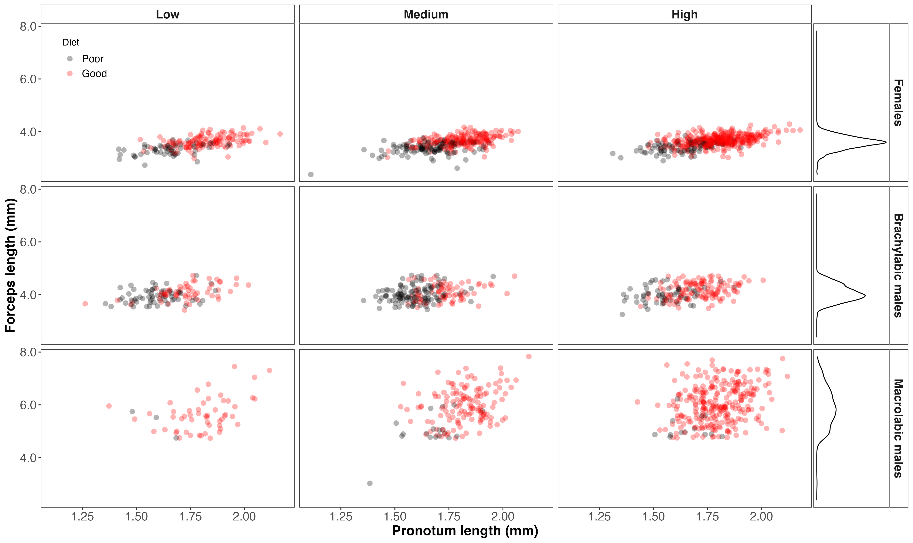
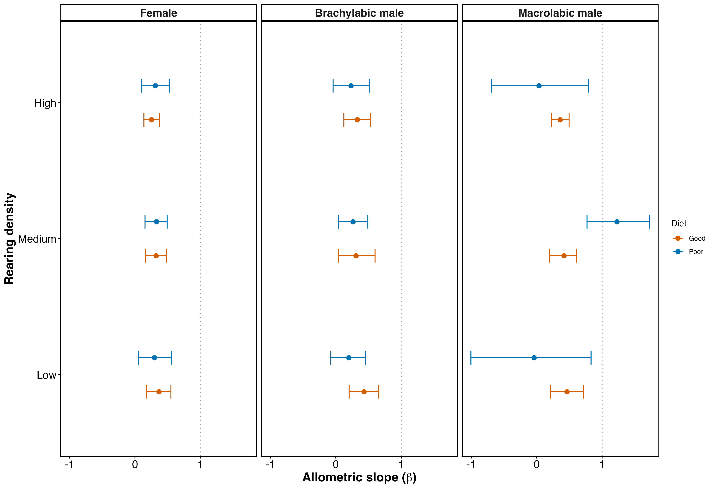

```{r echo=FALSE}
knitr::read_chunk('scripts/2026_earwig_allometry.R')
```

```{r analysis, include=FALSE,echo=FALSE, warning=FALSE, results="hide"}
```

\newpage

# Abstract

Static allometries describe how trait size covaries with body size and are often treated as stable descriptors of trait architecture. We quantified forceps allometry in the European earwig (*Forficula auricularia*) using a split-brood experiment manipulating diet and social density. Females, brachylabic males, and macrolabic males were analysed separately in a hierarchical Bayesian model that allowed scaling relationships to vary among groups, environments, maternal families, and rearing dishes. Most posterior median slopes were below one. We found no clear evidence that female and brachylabic male slopes differed across environments, and macrolabic male slopes were also similar under most conditions. A steeper relationship was estimated for macrolabic males under poor diet at medium density, but the credible interval included isometry and the estimate was based on 18 individuals. Environmental differences in slopes were otherwise small or uncertain. A quadratic model received somewhat greater predictive support and suggested curvature near the extremes of the body-size distribution, particularly in macrolabic males, but did not alter the broad pattern of similarity. Variation among maternal families and rearing dishes was small. Overall, the results suggest that forceps allometry is largely conserved across phenotypes and environments, with limited and uncertain divergence associated with the exaggerated male morph.

\newpage

# Introduction

Static allometry describes how trait size covaries with body size among individuals at the same developmental stage and provides a central framework for understanding the evolution of exaggerated morphology. Sexually selected weapons often exhibit positive allometry, such that larger individuals tend to express disproportionately larger traits [@voje2016; @kodric-brown2006; @bonduriansky2007]. However, hyperallometry is not universal. When traits serve both sexual and viability functions, or when functional and mechanical constraints limit disproportionate investment, isometry or hypoallometry may evolve instead [@bonduriansky2003; @eberhard2018; @kelly2026]. Consequently, scaling relationships reflect how developmental processes, functional performance, and selection interact to generate patterns of trait variation.

Static allometry is typically described by a linear relationship between log-transformed trait size and body size. In this framework, the slope (scaling exponent) describes the strength of covariation between trait size and body size and therefore the degree of size-dependent exaggeration [@pelabon2014; @voje2016]. Differences in scaling exponents among groups can indicate that trait exaggeration changes with body size, whereas similar slopes are consistent with a shared relationship between trait size and body size despite differences in average trait expression. Because scaling exponents link developmental variation in body size to variation in trait expression, they provide a useful means of evaluating how exaggerated traits vary within and among populations [@bonduriansky2007; @shingleton2013].

Sexual dimorphism is often viewed as the evolutionary divergence of males and females from a shared developmental architecture. However, dimorphism can arise through multiple pathways. Males and females may differ in average trait expression while retaining similar allometric relationships, or divergence may occur through changes in how trait size scales with body size. Recent evidence from the maritime earwig *Anisolabis maritima* demonstrates that females, like males, can exhibit positively allometric forceps, highlighting that weapon exaggeration is not necessarily restricted to males [@matsuzawa2025]. Species expressing alternative male phenotypes provide an opportunity to examine these processes in greater detail because males themselves are partitioned into discrete reproductive forms. In such systems, one male morph may resemble females more closely than other males, raising the possibility that sexual dimorphism is concentrated within a subset of the male population rather than distributed uniformly across all males. Understanding whether alternative male phenotypes differ from females in scaling relationships therefore offers insight into how sexual dimorphism and trait exaggeration evolve from shared developmental programs. Under the developmental threshold model, the major morph arises through activation of a developmental program for exaggerated trait growth when body size exceeds a critical value, whereas the minor morph retains a more "default" morphology produced in the absence of that program [@tomkins2005a; @emlen2007]; this framework provides a mechanistic basis for the classical view of males as exaggerated females [@darwin1871; @bonduriansky2007a] and predicts that the minor morph should resemble females more closely than the major morph in scaling relationships as well as in absolute trait size.

Species expressing alternative reproductive phenotypes provide particularly valuable models for examining the structure of allometry. In these species, males adopt discrete morphs that differ in weapon size, behaviour, and reproductive tactics [@gross1996; @shuster2003; @oliveira2008]. Because morphs share much of their genome and developmental environment, differences in scaling relationships can reveal how exaggeration evolves within a single species. Although alternative male phenotypes have been documented in many taxa, relatively few studies have quantified morph-specific static allometries, and even fewer have examined how developmental environments influence scaling relationships among morphs [@kochensparger2024; @kelly2026].

Environmental conditions can influence both body size and trait expression and may therefore alter static allometries [@emlen1997; @frankino2005; @shingleton2007]. Nutritional stress, for example, can reduce investment in sexually selected structures, whereas social conditions such as rearing density may modify developmental trajectories through competition or social interactions. Environmental effects on scaling exponents would indicate plasticity in the relationship between trait size and body size, whereas similar scaling exponents across environments would imply canalization of allometric relationships [@frankino2005; @shingleton2007; @nijhout2012]. Determining whether developmental environments modify scaling relationships is therefore important for understanding the extent to which trait exaggeration is environmentally sensitive. Complementary structural modelling of the same study system demonstrates that developmental environments influence forceps expression both indirectly through body size and directly through trait-specific developmental pathways, particularly in males [@ozkansubmitted].

Beyond sex, morph, and environment, variation among maternal families can provide insight into the developmental and evolutionary structure of allometry. Families may differ not only in average trait expression but also in the strength of the relationship between trait size and body size. Such variation could arise from genetic differences, maternal effects, or shared developmental conditions. Quantifying among-family variation in allometric slopes therefore offers a means of assessing whether scaling relationships themselves vary among related individuals [@lande1980; @pelabon2014; @hansen2008; @klingenberg2008].

The European earwig (*Forficula auricularia*) provides a useful system for examining how sexual dimorphism and alternative male phenotypes are structured through allometry. Males express two discrete forceps morphs, commonly referred to as brachylabic and macrolabic males, which differ markedly in weapon size and shape [@simmons1996; @tomkins2005a] (@fig-one). Forceps function both as sexual weapons during male–male interactions and as defensive structures, making them traits with dual functions [@meunier2024; @kamimura2024]. Because these morphs coexist within the same population, earwigs provide an opportunity to ask whether males share a common scaling relationship that differs from females, or whether any divergence is associated more strongly with one male morph. Previous studies have documented morph-specific differences in forceps exaggeration, raising the possibility that alternative male phenotypes may follow different allometric trajectories [@simmons1996; @tomkins2005a]. Moreover, recent work on another earwig species revealed positive allometry in female forceps, suggesting that sex differences in forceps scaling may be evolutionarily labile [@matsuzawa2025]. In *F. auricularia*, the macrolabic morph bears the more exaggerated weapon, whereas the brachylabic morph is more common in many populations and tends to be favoured under poorer developmental conditions. This pattern is broadly consistent with the possibility that brachylabic males retain a more female-like morphology under a threshold model of morph expression [@tomkins1999; @tomkins2004a; @tomkins2005a].

Here, we quantify static allometries of forceps length in female, brachylabic male, and macrolabic male *F. auricularia* reared under experimentally manipulated diet and density conditions. We first test whether the three phenotypic groups differ in allometric scaling relationships and whether any divergence is consistent across developmental environments. We then assess whether developmental conditions modify scaling exponents within each group and whether allometric relationships vary among maternal families. By integrating sex, morph, environment, and family effects within a hierarchical framework, we evaluate whether weapon allometry is broadly conserved across phenotypic groups or whether divergence is concentrated within particular male morphs.

# Methods

### Study species and experimental design

Adult female earwigs morphologically assignable to the *Forficula auricularia* species complex (*F. auricularia sensu lato*) were collected by hand at night from vegetation in Parc Outremont (Montréal, Québec, Canada) during September and October 2024. The European earwig is now recognized as a complex of closely related lineages that cannot always be distinguished reliably using external morphology alone [@gonzalez-miguens2020]. Because individuals were not genetically assigned to lineage, we refer to them as *F. auricularia sensu lato* throughout. This taxonomic uncertainty should not affect treatment comparisons in the present study because all individuals originated from the same local population and were randomly assigned to experimental treatments, although caution may be warranted when comparing results among studies conducted on genetically characterized lineages.

Females (n = 115) were transported to the laboratory at the Université du Québec à Montréal and housed individually in 90-mm Petri dishes containing moist sand. Each dish was supplied with a cotton-plugged water tube and TetraMin Tropical Flakes (United Pet Group, Germany), and females were assigned unique identification codes. Earwigs were maintained in darkness at 10°C (Percival Scientific, Perry, IA, USA) to simulate overwintering conditions. Dishes were checked daily for egg laying, and food and water were replenished as required. Following oviposition (approximately early December), food and water were removed and dishes were inspected weekly. Beginning in January 2025, dishes were checked daily for hatching. Hatching occurred between 13 and 29 January 2025, and all 115 females successfully produced offspring.

For two weeks following hatching, families were provided with food and water ad libitum. This period allowed nymphs to complete an early moult and attain a size suitable for manual transfer to experimental dishes. To manipulate developmental conditions, we varied both nutritional quality and social density. Diet treatment consisted of either a good-quality diet (100% TetraMin Tropical Flakes) or a poor-quality diet (75% TetraMin Tropical Flakes and 25% non-digestible α-cellulose). Density treatment consisted of one, four, or eight individuals per dish. Offspring from each family were randomly assigned among treatment combinations using a split-brood design to minimize confounding between maternal background and environmental treatment. Experimental dishes were maintained at 20°C and contained a water tube, treatment-specific food, and a refuge constructed from four sections of paper straw. In total, 1,265 dishes were established. Mothers were euthanized by freezing at −20°C after offspring had been assigned to treatments. Dishes were inspected several times per week for mortality and adult emergence, and food and water were replenished as needed.

### Morphological measurements

Once offspring reached adulthood, they were removed from their dish, assigned a unique identification code, and the date of adult emergence was recorded. Pronotum length (a proxy for body size) and forceps length were photographed under a Leica S6D stereomicroscope (Leica Microsystems Inc., Concord, ON, Canada) at 0.68× magnification using Enersight software. Measurements were obtained to the nearest 0.001 mm using Fiji image-analysis software [@schindelin2012] following established procedures [@vanlieshout2009]. Measurements were conducted blind to treatment whenever possible. To assess measurement repeatability, a subset of 30 individuals was measured twice. Intraclass correlation coefficients indicated high repeatability for both pronotum length (ICC = 0.94) and forceps length (ICC = 0.97).

### Data preparation and statistical analyses

All analyses were conducted in R version 4.4.2 [@rcoreteam2025]. Individuals were retained only when the final number of survivors preserved the intended density treatment (low density: one survivor; medium density: at least three survivors; high density: at least six survivors). Individuals lacking sex information were excluded. Final sample sizes for each phenotypic group and developmental environment are provided in Table S1. Pronotum length and forceps length were log-transformed prior to analysis to linearize allometric relationships and reduce heteroscedasticity.

Male morphs were classified using finite mixture modelling implemented in the package *mixsmsn* [@prates2013]. Raw male forceps lengths were modelled as a two-component skew-normal mixture distribution, and males were assigned to the component with the highest posterior probability. This procedure identified the two discrete male morphs traditionally recognized in *F. auricularia*: brachylabic and macrolabic males.

We analysed allometric relationships using a hierarchical Bayesian model fitted with the package *brms* [@burkner2017] and the *cmdstanr* backend. Log-transformed forceps length was modelled as a function of log-transformed pronotum length (body size), phenotypic group, diet, density, and all lower-order and higher-order interactions among these predictors. Phenotypic group comprised three levels: females, brachylabic males, and macrolabic males. Treating females and the two male morphs as equivalent levels of a single factor allowed direct comparisons among all phenotypes without assuming a single male allometric relationship.

Interactions involving body size allowed allometric slopes to vary among phenotypic groups and developmental environments. Terms not involving body size describe differences in model intercepts among groups and environments. Maternal identity was included as a varying intercept and varying slope for body size, allowing maternal families to differ in both average forceps expression and allometric scaling. Rearing-dish identity was additionally included as a varying intercept to account for non-independence among individuals raised in the same dish.

To evaluate whether allometric relationships deviated from linearity, we fitted an alternative model that additionally included a quadratic body-size term and all corresponding interactions. Predictive performance of the linear and quadratic models was compared using approximate leave-one-out cross-validation (LOO) [@vehtari2017].

Weakly informative priors were specified as normal(0, 1) for fixed-effect coefficients, normal(0, 2) for the intercept, Student-*t*(3, 0, 1) for residual and varying-effect standard deviations, and LKJ(2) for the maternal intercept–slope correlation. Models were fitted using four Hamiltonian Monte Carlo chains of 4,000 iterations each, including 2,000 warm-up iterations, with an `adapt_delta` of 0.97. Convergence was assessed using trace plots, effective sample sizes, divergent transitions, and the potential scale reduction statistic [$\hat{R}$; @vehtari2021]. All models showed satisfactory convergence (Table S2).

Condition-specific allometric slopes were estimated from posterior distributions using the function `emtrends()` in the package *emmeans* [@lenth2019package]. Slopes were estimated separately for each combination of phenotypic group, diet treatment, and density treatment. Pairwise contrasts among phenotypic groups and developmental environments were derived from the same posterior distributions. Pairwise contrasts were calculated as the first level minus the second level (e.g., female − macrolabic or good diet − poor diet), such that negative values indicate larger estimates for the second level. We report posterior medians and 95% credible intervals throughout. Inference was based on posterior distributions rather than null-hypothesis significance testing.

# Results

```{r}
#| label: among-family-dish-statistics
#| echo: false
#| message: false
#| warning: false

library(posterior)

# Extract posterior draws from the final model
mod_all_draws <- posterior::as_draws_df(mod_all)

# Helper function: posterior median and 95% credible interval
summarise_parameter <- function(variable, draws = mod_all_draws) {
  
  if (!variable %in% names(draws)) {
    stop(
      paste0(
        "Parameter '", variable, "' was not found in the model draws."
      )
    )
  }
  
  x <- draws[[variable]]
  
  list(
    median = median(x),
    lower  = unname(quantile(x, 0.025)),
    upper  = unname(quantile(x, 0.975))
  )
}

# Maternal-family varying effects
fam_intercept_sd <- summarise_parameter(
  "sd_id_mere__Intercept"
)

fam_slope_sd <- summarise_parameter(
  "sd_id_mere__logP"
)

fam_intercept_slope_cor <- summarise_parameter(
  "cor_id_mere__Intercept__logP"
)

# Rearing-dish varying intercept
dish_intercept_sd <- summarise_parameter(
  "sd_boite_petri__Intercept"
)

# Residual standard deviation
residual_sd <- summarise_parameter(
  "sigma"
)

# Formatting helper
fmt2 <- function(x) {
  sprintf("%.2f", x)
}
```

Females exhibited a continuous distribution of weapon sizes across body sizes (pronotum length: mean ± SD = `r myround(summary.table.2$mean_pronotum[summary.table.2$group3 == "female"], 2)` ± `r myround(summary.table.2$sd_pronotum[summary.table.2$group3 == "female"], 2)` mm; forceps length: mean ± SD = `r myround(summary.table.2$mean_forceps[summary.table.2$group3 == "female"], 2)` ± `r myround(summary.table.2$sd_forceps[summary.table.2$group3 == "female"], 2)` mm, n = `r summary.table.2$n[summary.table.2$group3 == "female"]`). Males formed two discrete clusters corresponding to brachylabic (pronotum length: mean ± SD = `r myround(summary.table.2$mean_pronotum[summary.table.2$group3 == "brachylabic"], 2)` ± `r myround(summary.table.2$sd_pronotum[summary.table.2$group3 == "brachylabic"], 2)` mm; forceps length: mean ± SD = `r myround(summary.table.2$mean_forceps[summary.table.2$group3 == "brachylabic"], 2)` ± `r myround(summary.table.2$sd_forceps[summary.table.2$group3 == "brachylabic"], 2)` mm, n = `r summary.table.2$n[summary.table.2$group3 == "brachylabic"]`) and macrolabic morphs (pronotum length: mean ± SD = `r myround(summary.table.2$mean_pronotum[summary.table.2$group3 == "macrolabic"], 2)` ± `r myround(summary.table.2$sd_pronotum[summary.table.2$group3 == "macrolabic"], 2)` mm; forceps length: mean ± SD = `r myround(summary.table.2$mean_forceps[summary.table.2$group3 == "macrolabic"], 2)` ± `r myround(summary.table.2$sd_forceps[summary.table.2$group3 == "macrolabic"], 2)` mm, n = `r summary.table.2$n[summary.table.2$group3 == "macrolabic"]`), with overlap in body size but substantial separation in forceps length (@fig-two).

### Differences among females and male morphs

Forceps length generally increased with pronotum length, and most posterior median slopes were below one (@fig-three; Table S5; Figure S1). Treating females, brachylabic males, and macrolabic males as three phenotypic groups revealed broadly similar scaling relationships across most developmental environments. Under good diet and low density, estimated slopes were `r myround(slope_table$logP.trend[slope_table$group3 == "female" & slope_table$diet == "GOOD" & slope_table$density == "1"],2)` (95% CrI: `r myround(slope_table$lower.HPD[slope_table$group3 == "female" & slope_table$diet == "GOOD" & slope_table$density == "1"],2)`–`r myround(slope_table$upper.HPD[slope_table$group3 == "female" & slope_table$diet == "GOOD" & slope_table$density == "1"],2)`) in females, `r myround(slope_table$logP.trend[slope_table$group3 == "brachylabic" & slope_table$diet == "GOOD" & slope_table$density == "1"],2)` (95% CrI: `r myround(slope_table$lower.HPD[slope_table$group3 == "brachylabic" & slope_table$diet == "GOOD" & slope_table$density == "1"],2)`–`r myround(slope_table$upper.HPD[slope_table$group3 == "brachylabic" & slope_table$diet == "GOOD" & slope_table$density == "1"],2)`) in brachylabic males, and `r myround(slope_table$logP.trend[slope_table$group3 == "macrolabic" & slope_table$diet == "GOOD" & slope_table$density == "1"],2)` (95% CrI: `r myround(slope_table$lower.HPD[slope_table$group3 == "macrolabic" & slope_table$diet == "GOOD" & slope_table$density == "1"],2)`–`r myround(slope_table$upper.HPD[slope_table$group3 == "macrolabic" & slope_table$diet == "GOOD" & slope_table$density == "1"],2)`) in macrolabic males. Pairwise differences among groups were generally small or uncertain, with contrast intervals overlapping zero across most environments (Table S6).

A quadratic model had somewhat better expected out-of-sample predictive performance than the linear model (ΔELPD = `r myround(abs(loo_table$elpd_diff[loo_table$Model == "Linear model"]),2)`, SE = `r myround(loo_table$se_diff[loo_table$Model == "Linear model"],2)`; Table S4), providing some evidence of curvature in the relationship between body size and forceps length. The quadratic predictions did not substantially alter the broad comparison among phenotypic groups, although they revealed localized departures from linearity (Figure S2). Curvature was most apparent near the extremes of the observed body-size range in several macrolabic male groups, where predictions were influenced by relatively few individuals. These edge patterns should therefore be interpreted cautiously and do not necessarily imply strong curvature across the central portion of the body-size distribution. We use the linear model to summarize average condition-specific allometric exponents and treat the quadratic model as a sensitivity analysis.

Across the full set of developmental environments, there was little evidence that females and brachylabic males differed consistently in allometric slope (Table S6). The contrast interval between females and brachylabic males included zero in every diet-by-density combination examined. Macrolabic male slopes were also similar to those of females and brachylabic males under most environmental conditions. The clearest exception occurred under poor diet at medium density, where the estimated slope for macrolabic males (`r myround(slope_table$logP.trend[slope_table$group3 == "macrolabic" & slope_table$diet == "POOR" & slope_table$density == "4"],2)`, 95% CrI: `r myround(slope_table$lower.HPD[slope_table$group3 == "macrolabic" & slope_table$diet == "POOR" & slope_table$density == "4"],2)`–`r myround(slope_table$upper.HPD[slope_table$group3 == "macrolabic" & slope_table$diet == "POOR" & slope_table$density == "4"],2)`) was steeper than those estimated for females (`r myround(slope_table$logP.trend[slope_table$group3 == "female" & slope_table$diet == "POOR" & slope_table$density == "4"],2)`, 95% CrI: `r myround(slope_table$lower.HPD[slope_table$group3 == "female" & slope_table$diet == "POOR" & slope_table$density == "4"],2)`–`r myround(slope_table$upper.HPD[slope_table$group3 == "female" & slope_table$diet == "POOR" & slope_table$density == "4"],2)`) and brachylabic males (`r myround(slope_table$logP.trend[slope_table$group3 == "brachylabic" & slope_table$diet == "POOR" & slope_table$density == "4"],2)`, 95% CrI: `r myround(slope_table$lower.HPD[slope_table$group3 == "brachylabic" & slope_table$diet == "POOR" & slope_table$density == "4"],2)`–`r myround(slope_table$upper.HPD[slope_table$group3 == "brachylabic" & slope_table$diet == "POOR" & slope_table$density == "4"],2)`). Pairwise contrast intervals excluded zero in this environment (Table S6). This result should nevertheless be interpreted cautiously because the estimate was based on only 18 poor-diet macrolabic males at medium density (Table S1).

Posterior median slopes for females and brachylabic males were below one in every developmental environment examined. The posterior median for macrolabic males exceeded one only under poor diet at medium density (`r myround(slope_table$logP.trend[slope_table$group3 == "macrolabic" & slope_table$diet == "POOR" & slope_table$density == "4"],2)`, 95% CrI: `r myround(slope_table$lower.HPD[slope_table$group3 == "macrolabic" & slope_table$diet == "POOR" & slope_table$density == "4"],2)`–`r myround(slope_table$upper.HPD[slope_table$group3 == "macrolabic" & slope_table$diet == "POOR" & slope_table$density == "4"],2)`). Because this credible interval included one, the evidence that this relationship was hyperallometric rather than isometric was uncertain. The small sample of poor-diet macrolabic males further limits inference from this treatment combination (Table S1).

### Environmental effects on scaling

Estimated environmental differences in allometric slopes were generally small or uncertain. In females, diet contrast intervals included zero at all densities (@fig-three; Table S6), providing little evidence that nutritional conditions altered scaling relationships. Diet contrasts for brachylabic males were likewise uncertain across all density treatments.

The clearest indication of environmental variation involved macrolabic males, but these estimates should be interpreted cautiously because poor-diet macrolabic males were uncommon at low density (*n* = 3), medium density (*n* = 18), and high density (*n* = 13) (Table S1). At medium density, the estimated slope was steeper under poor diet than under good diet (good–poor contrast = -0.82, 95% CrI: -1.33 to -0.31). Diet contrast intervals included zero at low and high densities (Table S6).

Density contrast intervals also included zero for females and brachylabic males (@fig-three; Table S6). Among poor-diet macrolabic males, the estimated slope at medium density exceeded those at low density (difference = -1.28, 95% CrI: -2.31 to -0.28) and high density (difference = 1.22, 95% CrI: 0.36 to 2.05). Thus, the clearest estimated environmental differences were associated with poor-diet macrolabic males at medium density. Because all three poor-diet macrolabic groups had small samples, these contrasts should be regarded as provisional.

### Among-family variation

Estimated variation among maternal families was small (Table S3). The posterior median standard deviation of family-level intercepts was `r fmt2(fam_intercept_sd$median)` (95% CrI: `r fmt2(fam_intercept_sd$lower)`–`r fmt2(fam_intercept_sd$upper)`), indicating limited among-family variation in forceps expression after accounting for body size, phenotypic group, diet, and density. The standard deviation of family-level allometric slopes was `r fmt2(fam_slope_sd$median)` (95% CrI: `r fmt2(fam_slope_sd$lower)`–`r fmt2(fam_slope_sd$upper)`), indicating some uncertainty and variation among families in the relationship between body size and forceps length.

The correlation between family-level intercepts and slopes was negative but highly uncertain (*r* = `r fmt2(fam_intercept_slope_cor$median)`, 95% CrI: `r fmt2(fam_intercept_slope_cor$lower)`–`r fmt2(fam_intercept_slope_cor$upper)`), providing little evidence for a consistent association between forceps expression and allometric scaling among families. Variation among rearing dishes was small (SD = `r fmt2(dish_intercept_sd$median)`, 95% CrI: `r fmt2(dish_intercept_sd$lower)`–`r fmt2(dish_intercept_sd$upper)`), as was residual variation (SD = `r fmt2(residual_sd$median)`, 95% CrI: `r fmt2(residual_sd$lower)`–`r fmt2(residual_sd$upper)`).

# Discussion

Static allometries are often treated as stable descriptors of morphological architecture [@huxley1932; @gould1966; @voje2016], yet the extent to which scaling relationships vary among phenotypes and environments remains an important question in evolutionary biology [@pelabon2014; @voje2016]. By analysing females, brachylabic males, and macrolabic males as separate phenotypic groups, we found that forceps allometry in the European earwig was characterised more by similarity than by consistent divergence. There was no clear evidence that females and brachylabic males differed in slope in any developmental environment, and macrolabic male slopes were also similar to those of the other groups under most conditions. Where a clear slope difference was estimated, it involved macrolabic males under poor diet at medium density, a treatment combination represented by only 18 individuals. Environmental contrasts were otherwise generally small or uncertain. These results suggest that forceps allometry is broadly conserved across phenotypes and environments, while leaving open the possibility of limited, context-dependent divergence associated with the exaggerated male morph.

Sexual dimorphism is classically framed as the divergence of males from a shared female "ground plan," with males viewed as modified females and exaggerated male traits interpreted as departures from a default developmental programme [@darwin1871; @bonduriansky2007a]. Under this view, alternative male morphs might differ from females in proportion to their degree of exaggeration. Our results provide partial support for this expectation: brachylabic male slopes did not clearly differ from female slopes, whereas the clearest estimated departure involved macrolabic males. However, that departure was restricted to one sparsely sampled developmental environment, so the evidence for systematic asymmetric divergence between the male morphs remains limited. The observed pattern is nevertheless broadly compatible with developmental threshold models in which activation of a growth programme produces the exaggerated major morph, while the minor morph retains a morphology closer to the ancestral or female condition [@tomkins2005a; @emlen2007]. In horned beetles, for example, minor males can arise through failure to initiate horn-growth pathways and consequently resemble females more closely than major males [@emlen2007]. Comparative evidence from neotropical harvestmen similarly suggests that minor-male weapon expression may track female expression more closely than major-male expression across species [@buzatto2014]. Whether the same developmental mechanism underlies the pattern in *F. auricularia* will require direct study of morph determination and weapon growth.

Morph-specific scaling does not follow a single pattern across male-dimorphic systems. In the Wellington tree wētā (*Hemideina crassidens*), weapon allometries did not align closely with the degree of weapon exaggeration or the presumed mating role of each morph [@kelly2026]. The present estimates provide a tentative contrast, because the exaggerated macrolabic morph showed the clearest allometric departure, although only under one developmental condition. Taken together, these studies suggest that alternative reproductive phenotypes can differ substantially in weapon expression without necessarily showing consistent differences in static allometry. The relationship between morph exaggeration and allometric slope may therefore depend on the developmental and functional context of each system.

The prevalence of posterior median slopes below one is also noteworthy. Sexually selected weapons are often expected to exhibit positive or hyperallometric scaling [@kodric-brown2006; @bonduriansky2007], yet the posterior median slope was below one in all but one phenotype-by-environment combination. In the remaining combination, the median exceeded one but its credible interval included isometry. This pattern is consistent with growing recognition that exaggerated sexual traits need not be hyperallometric [@bonduriansky2003; @eberhard2018; @kelly2026] and with comparative work showing that allometric slope and intercept can evolve partly independently [@painting2024]. Earwig forceps serve multiple functions, including male–male competition, predator defence, prey handling, and courtship interactions [@kamimura2014; @meunier2024]. Such multifunctionality could limit disproportionate investment in a single function and favour more moderate scaling, although the present study does not test that mechanism directly. A recent study in *F. auricularia* also found no association between male forceps length and six behavioural or physiological traits commonly assumed to indicate male quality [@blackwell2024], suggesting that the selective information conveyed by forceps size may be less straightforward than a classical condition-dependent weapon model assumes. The broadly similar slopes estimated for females and both male morphs are consistent with shared functional or developmental constraints despite marked differences in absolute forceps size. Positive allometry in female *Anisolabis maritima* [@matsuzawa2025] further illustrates that female forceps scaling varies among earwig species and should not be assumed to follow a single regime.

Environmental effects on scaling relationships were generally limited or imprecisely estimated. Diet and density contrast intervals included zero for females and brachylabic males, and the clearest environmental contrasts were confined to poor-diet macrolabic males at medium density. Because poor-diet macrolabic males were uncommon in all density treatments, these estimates are sensitive to small samples and should be treated as provisional. The quadratic model had somewhat better expected predictive performance than the linear model and revealed localized curvature in several relationships, especially near the extremes of the body-size distribution in macrolabic males. Those portions of the fitted curves were influenced by relatively few observations, however, and did not provide strong evidence of curvature across the central body-size range. We therefore interpret the linear slopes as average summaries of condition-specific scaling rather than complete descriptions of every relationship. Overall, the data provide little evidence for broad environmental restructuring of allometry, while suggesting a possible environment-specific response in the exaggerated morph that warrants targeted testing with more balanced samples. This interpretation is also compatible with evidence that selection on weapon allometry can act more strongly on the intercept than on the slope [@emberts2023], raising the possibility that developmental environments influence weapon expression mainly through average trait size rather than large changes in scaling.

The similarity of female and brachylabic male slopes may provide some insight into morph differentiation, but it does not identify the underlying mechanism. Morph expression in *F. auricularia* is influenced by both genetic and environmental factors [@tomkins1999], and morph frequencies can shift with population density over short geographic distances [@tomkins2004a]. The substantial overlap in body size between brachylabic and macrolabic males in our sample indicates that body size alone does not perfectly separate the morphs. At the same time, the generally similar slopes do not suggest wholesale restructuring of the relationship between body size and forceps length. This pattern is broadly compatible with threshold models in which discrete morph expression arises through changes in developmental pathways affecting weapon growth against a largely shared background of body-size scaling [@tomkins2005a; @emlen2007]. More generally, developmental reaction-norm models propose that exaggerated morphologies evolve through modifications of the relationship between trait growth and body size, sometimes mediated by threshold-like switches [@emlen2000; @emlen2007]. Direct measurements of developmental pathways would be needed to determine whether this mechanism explains the limited allometric differences observed here.

Estimated variation among maternal families was small, although the posterior distribution for the family-level slope standard deviation indicated some heterogeneity in scaling among families. The correlation between family-level intercepts and slopes was highly uncertain, providing little evidence that families producing relatively large forceps also tended to show steeper allometries. Because maternal identity combines genetic effects, maternal effects, and aspects of the shared early environment, these data cannot establish that the observed family variation is heritable. They instead indicate that scaling relationships may vary modestly among maternal lineages and motivate designs capable of separating genetic from environmental sources of that variation [@lande1980; @pelabon2014].

More broadly, our results are compatible with viewing static allometry as a hierarchical phenotype shaped by variation at several biological levels [@emlen2000]. The most robust pattern in this study was broad similarity across females, male morphs, and developmental environments, accompanied by a limited number of context-specific departures. Analysing the male morphs separately was nevertheless important because pooling them would have concealed the steeper slope estimated for poor-diet macrolabic males at medium density and the greater curvature near the extremes of some macrolabic body-size distributions. Studies that pool alternative male phenotypes may therefore overlook heterogeneity in scaling, even when that heterogeneity is subtle or restricted to particular environments [e.g. @kelly2005a; see also @kochensparger2024]. Our findings support treating alternative reproductive phenotypes explicitly in analyses of sexual dimorphism, while also emphasizing that differences among morphs should not be assumed to be pervasive. In *F. auricularia*, forceps allometry appears largely conserved, with tentative evidence that the exaggerated male morph can depart from this shared pattern under some developmental conditions.

# Data availability

Data are available through the OSF repository at https://osf.io/m7c53/overview?view_only=ce50e42b29284cbe8164e768ecb9c2b1.

# Funding

The study was funded by a Discovery Grant from the Natural Sciences and Engineering Research Council of Canada (NSERC) to CDK.

# Conflict of Interest

We declare no conflicts of interest.

# Acknowledgements

We thank Andreanne Nault for her help in the lab.

\newpage

# References {.unnumbered}

::: {#refs}
:::

\newpage

## Figures

::: {#fig-one fig-cap="Visual comparison of forceps size and shape across sexes and male morphs: (a) female, (b) brachylabic male, and (c) macrolabic male. Macrolabic males have longer and more strongly curved forceps than brachylabic males and females. Photographs are of adults from the experimental population (Parc Outremont, Montréal). Scale bars = 1 mm."}
{width=8.67cm height=16.55cm}
:::

\newpage

::: {#fig-two fig-cap="Relationship between pronotum length (body size) and forceps length in female, brachylabic male, and macrolabic male Forficula auricularia reared under two diet treatments (good and poor) and three density treatments (low, medium, and high). Points represent individual adults. Rows correspond to phenotypic groups and columns correspond to density treatments. Colours indicate developmental diet. Density distributions of forceps length for each phenotypic group are shown in the right-hand panels. Females exhibited a continuous distribution of forceps sizes, whereas males formed two discrete morphs that overlapped in body size but differed markedly in forceps length. Macrolabic males possessed substantially longer forceps than brachylabic males across the observed range of body sizes. Sample sizes for each diet-by-density combination are provided in Table S1."}

:::

\newpage

::: {#fig-three fig-cap="Posterior median allometric slopes (β) and 95% credible intervals describing the relationship between forceps length and pronotum length in females, brachylabic males, and macrolabic males across diet and density treatments. Slope estimates were derived from a single Bayesian mixed-effects model fitted to all individuals, with phenotypic group, diet, density, and their interactions with body size included as fixed effects. The vertical dashed line indicates isometry (β = 1). Posterior medians below or above one correspond to hypoallometric or hyperallometric point estimates, respectively; credible intervals indicate uncertainty relative to isometry."}

:::

