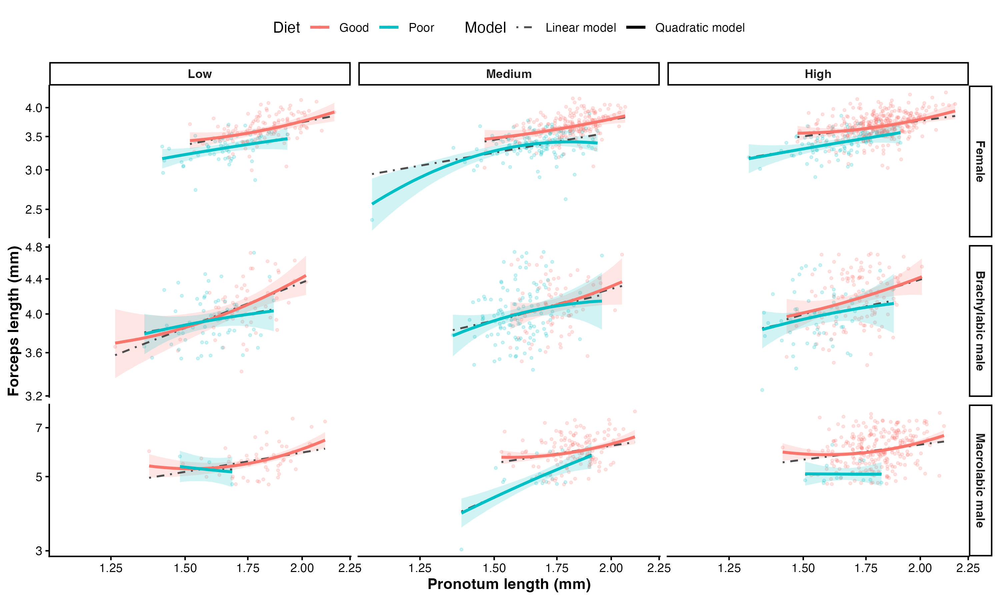

```{r setup, include=FALSE, echo=FALSE, warning=FALSE, results="hide"}
# Ensure 'here' is available for robust path management
if (!requireNamespace("here", quietly = TRUE)) install.packages("here")

# Explicitly source the main script
# This ensures all data cleaning and model loading occurs
source("scripts/2026_earwig_allometry.R")

# Quick check to ensure the model loaded correctly
if (!exists("mod_all")) {
  stop("Failed to load 'mod_all' from scripts/2026_earwig_allometry.R. Check if the model files exist in models/ using here::here()")
}
```

\newpage

**Table S1.** Sample sizes for each phenotypic group, diet treatment, and density treatment. These values indicate the number of individuals contributing to each condition-specific allometric slope estimate.
```{r}
#| echo: false
#| message: false
#| warning: false

table_s1 <- dat.morphs %>%
  count(group3, diet, density, name = "n") %>%
  mutate(
    group3 = recode(group3,
                    female = "Female",
                    brachylabic = "Brachylabic male",
                    macrolabic = "Macrolabic male"),
    diet = recode(diet,
                  GOOD = "Good",
                  POOR = "Poor"),
    density = recode(density,
                     `1` = "Low",
                     `4` = "Medium",
                     `8` = "High"),
    density = factor(density, levels = c("Low", "Medium", "High")),
    group3 = factor(group3,
                    levels = c("Female", "Brachylabic male", "Macrolabic male"))
  ) %>%
  arrange(group3, diet, density) %>%
  rename(
    `Phenotypic group` = group3,
    Diet = diet,
    Density = density,
    `Sample size` = n
  )

flextable(table_s1) %>%
  fontsize(size = 10, part = "all") %>%
  theme_booktabs() %>%
  autofit()
```

\newpage

**Table S2.** Convergence diagnostics for Bayesian allometry models.
```{r}
#| echo: false
#| message: false
#| warning: false

get_diagnostics <- function(model, model_name) {
  
  diag <- as_draws_df(model) %>%
    summarise_draws(rhat, ess_bulk, ess_tail) %>%
    filter(!variable %in% c("lp__", "lprior"))
  
  np <- nuts_params(model)
  
  tibble(
    Model = model_name,
    `Max Rhat` = max(diag$rhat, na.rm = TRUE),
    `Min Bulk ESS` = min(diag$ess_bulk, na.rm = TRUE),
    `Min Tail ESS` = min(diag$ess_tail, na.rm = TRUE),
    `Divergent transitions` = sum(
      np$Parameter == "divergent__" & np$Value == 1
    )
  )
}

table_s2 <- bind_rows(
  get_diagnostics(mod_all, "Linear allometry model"),
  get_diagnostics(mod_all_quad, "Quadratic allometry model")
) %>%
  mutate(
    `Max Rhat` = round(`Max Rhat`, 3),
    `Min Bulk ESS` = round(`Min Bulk ESS`, 0),
    `Min Tail ESS` = round(`Min Tail ESS`, 0)
  )

table_s2_ft <- table_s2 %>%
  flextable() %>%
  theme_booktabs() %>%
  autofit()

table_s2_ft
```

\newpage

**Table S3.** Posterior summaries from the unified three-group Bayesian allometry model. The model estimated log forceps length as a function of log pronotum length, phenotypic group, diet, density, and all interactions, with varying intercepts and body-size slopes for maternal family and a varying intercept for rearing dish. Reference levels were female, good diet, and low density. Values are posterior medians and 95% credible intervals.
```{r}
#| echo: false
#| message: false
#| warning: false

post <- posterior_summary(mod_all, robust = TRUE) %>%
  as.data.frame() %>%
  rownames_to_column("Parameter") %>%
  filter(!str_detect(Parameter, "lp__"))

post <- post %>%
  mutate(
    Section = case_when(
      str_detect(Parameter, "^b_") ~ "Fixed effects",
      str_detect(Parameter, "^sd_id_mere__") ~ "Among-family SD",
      str_detect(Parameter, "^cor_id_mere__") ~ "Among-family correlation",
      str_detect(Parameter, "^sd_boite_petri__") ~ "Among-dish SD",
      str_detect(Parameter, "^sigma$") ~ "Residual SD",
      TRUE ~ NA_character_
    )
  ) %>%
  filter(!is.na(Section))

clean_labels_all <- function(param) {

  # Clean multilevel and residual parameters first
  param <- case_when(
    param == "sd_id_mere__Intercept" ~
      "SD: intercept",

    param == "sd_id_mere__logP" ~
      "SD: body-size slope",

    param == "cor_id_mere__Intercept__logP" ~
      "Correlation: intercept × body-size slope",

    param == "sd_boite_petri__Intercept" ~
      "SD: intercept",

    param == "sigma" ~
      "Residual SD",

    TRUE ~ param
  )

  # Clean fixed-effect parameters
  param <- str_replace(param, "^b_", "")

  param <- str_replace_all(param, "logP", "Body size")
  param <- str_replace_all(
    param,
    "group3brachylabic",
    "Brachylabic male"
  )
  param <- str_replace_all(
    param,
    "group3macrolabic",
    "Macrolabic male"
  )
  param <- str_replace_all(param, "dietPOOR", "Poor diet")
  param <- str_replace_all(param, "density4", "Density = 4")
  param <- str_replace_all(param, "density8", "Density = 8")
  param <- str_replace_all(param, ":", " × ")

  param
}

section_levels <- c(
  "Fixed effects",
  "Among-family SD",
  "Among-family correlation",
  "Among-dish SD",
  "Residual SD"
)

table_s3 <- post %>%
  mutate(
    Section = factor(Section, levels = section_levels),
    Parameter = clean_labels_all(Parameter)
  ) %>%
  transmute(
    Section,
    Parameter,
    Estimate = round(Estimate, 2),
    `95% CrI` = paste0(
      round(Q2.5, 2),
      ", ",
      round(Q97.5, 2)
    )
  ) %>%
  arrange(Section) %>%
  mutate(Section = as.character(Section))

flextable(table_s3) %>%
  merge_v(j = "Section") %>%
  valign(j = "Section", valign = "top") %>%
  fontsize(size = 9, part = "all") %>%
  bold(part = "header") %>%
  theme_booktabs() %>%
  autofit()
```

\newpage

**Table S4.** Leave-one-out cross-validation comparison of the linear and quadratic allometry models. Both models included phenotypic group (female, brachylabic male, and macrolabic male), diet, density, body size (log pronotum length), and all interactions among these predictors, with varying intercepts and body-size slopes for maternal family and a varying intercept for rearing dish. The quadratic model additionally included a squared body-size term and its interactions with phenotypic group, diet, and density. Models were compared using expected log predictive density (ELPD), with larger values indicating better expected out-of-sample predictive performance. ELPD differences are reported relative to the best-supported model.
```{r}
#| echo: false
#| message: false
#| warning: false

loo_table_formatted <- loo_table %>%
  transmute(
    Model,
    `ELPD difference` = round(elpd_diff, 2),
    SE = round(se_diff, 2)
  )

flextable(loo_table_formatted) %>%
  theme_booktabs() %>%
  autofit()
```

\newpage

**Table S5.** Condition-specific allometric slopes from the unified three-group Bayesian allometry model. Slopes describe the relationship between log-transformed forceps length and log-transformed pronotum length for each phenotypic group, diet treatment, and density treatment. Values are posterior medians and 95% credible intervals.
```{r}
#| echo: false
#| message: false
#| warning: false

slopes_all <- emtrends(
  mod_all,
  ~ group3 * diet * density,
  var = "logP"
)

slope_table <- as.data.frame(slopes_all)

table_s5 <- slope_table %>%
  mutate(
    group3 = recode(group3,
                    female = "Female",
                    brachylabic = "Brachylabic male",
                    macrolabic = "Macrolabic male"),
    diet = recode(diet,
                  GOOD = "Good",
                  POOR = "Poor"),
    density = recode(density,
                     `1` = "Low",
                     `4` = "Medium",
                     `8` = "High"),
    density = factor(density, levels = c("Low", "Medium", "High")),
    group3 = factor(group3,
                    levels = c("Female", "Brachylabic male", "Macrolabic male"))
  ) %>%
  arrange(group3, diet, density) %>%
  transmute(
    `Phenotypic group` = group3,
    Diet = diet,
    Density = density,
    `Allometric slope` = round(logP.trend, 2),
    `95% CrI` = paste0(round(lower.HPD, 2), ", ", round(upper.HPD, 2))
  )

flextable(table_s5) %>%
  merge_v(j = c("Phenotypic group", "Diet")) %>%
  valign(j = c("Phenotypic group", "Diet"), valign = "top") %>%
  fontsize(size = 9, part = "all") %>%
  bold(part = "header") %>%
  theme_booktabs() %>%
  autofit()
```

\newpage

**Table S6.** Pairwise contrasts among phenotypic groups in allometric slope within each diet and density treatment. Contrasts were estimated from the unified three-group Bayesian allometry model using posterior distributions of condition-specific slopes. Contrasts are reported as the first level minus the second level; negative values therefore indicate larger slope estimates for the second level. Values are posterior medians and 95% credible intervals.
```{r}
#| echo: false
#| message: false
#| warning: false

group_slope_contrasts <- pairs(
  emtrends(mod_all, ~ group3 | diet * density, var = "logP")
)

contrast_table <- as.data.frame(group_slope_contrasts)

table_s6 <- contrast_table %>%
  mutate(
    diet = recode(diet,
                  GOOD = "Good",
                  POOR = "Poor"),
    density = recode(density,
                     `1` = "Low",
                     `4` = "Medium",
                     `8` = "High"),
    density = factor(density, levels = c("Low", "Medium", "High")),
    contrast = recode(
      contrast,
      "female - brachylabic" = "Female − brachylabic male",
      "female - macrolabic" = "Female − macrolabic male",
      "brachylabic - macrolabic" = "Brachylabic male − macrolabic male"
    )
  ) %>%
  arrange(diet, density, contrast) %>%
  transmute(
    Diet = diet,
    Density = density,
    Contrast = contrast,
    `Slope difference` = round(estimate, 2),
    `95% CrI` = paste0(round(lower.HPD, 2), ", ", round(upper.HPD, 2))
  )

flextable(table_s6) %>%
  merge_v(j = c("Diet", "Density")) %>%
  valign(j = c("Diet", "Density"), valign = "top") %>%
  fontsize(size = 9, part = "all") %>%
  bold(part = "header") %>%
  theme_booktabs() %>%
  autofit()
```

\newpage

**Table S7.** Good-diet minus poor-diet contrasts in condition-specific allometric slopes within each phenotypic group and density treatment. Contrasts were estimated from the unified three-group Bayesian allometry model. Negative values indicate a steeper estimated slope under poor diet. Values are posterior medians and 95% credible intervals.
```{r}
#| echo: false
#| message: false
#| warning: false

# Diet contrasts in allometric slope within each
# phenotypic group × density combination
table_s7 <- diet_contrast_table %>%
  mutate(
    group3 = recode(
      group3,
      female = "Female",
      brachylabic = "Brachylabic male",
      macrolabic = "Macrolabic male"
    ),

    group3 = factor(
      group3,
      levels = c(
        "Female",
        "Brachylabic male",
        "Macrolabic male"
      )
    ),

    density = recode(
      density,
      `1` = "Low",
      `4` = "Medium",
      `8` = "High"
    ),

    density = factor(
      density,
      levels = c("Low", "Medium", "High")
    ),

    contrast = recode(
      contrast,
      "GOOD - POOR" = "Good − poor"
    )
  ) %>%
  arrange(group3, density) %>%
  transmute(
    `Phenotypic group` = group3,
    Density = density,
    Contrast = contrast,
    `Slope difference` = round(logP.trend, 2),
    `95% CrI` = paste0(
      round(lower.HPD, 2),
      ", ",
      round(upper.HPD, 2)
    )
  )

flextable(table_s7) %>%
  merge_v(j = c("Phenotypic group", "Density")) %>%
  valign(
    j = c("Phenotypic group", "Density"),
    valign = "top"
  ) %>%
  fontsize(size = 9, part = "all") %>%
  bold(part = "header") %>%
  theme_booktabs() %>%
  autofit()
```

\newpage

**Table S8.** Pairwise contrasts among density treatments in condition-specific allometric slopes within each phenotypic group and diet treatment. Contrasts were estimated from the unified three-group Bayesian allometry model and are reported as the first density minus the second. Negative values indicate a steeper estimated slope at the second density. Values are posterior medians and 95% credible intervals.
```{r}
#| echo: false
#| message: false
#| warning: false

# Density contrasts in allometric slope within each
# phenotypic group × diet combination
density_slope_contrasts <- pairs(
  emtrends(
    mod_all,
    ~ density | group3 * diet,
    var = "logP"
  )
)

density_contrast_table <- as.data.frame(density_slope_contrasts)

table_s8 <- density_contrast_table %>%
  mutate(
    group3 = recode(
      group3,
      female = "Female",
      brachylabic = "Brachylabic male",
      macrolabic = "Macrolabic male"
    ),

    group3 = factor(
      group3,
      levels = c(
        "Female",
        "Brachylabic male",
        "Macrolabic male"
      )
    ),

    diet = recode(
      diet,
      GOOD = "Good",
      POOR = "Poor"
    ),

    diet = factor(
      diet,
      levels = c("Good", "Poor")
    ),

    contrast = recode(
      contrast,
      "density1 - density4" = "Low − medium",
      "density1 - density8" = "Low − high",
      "density4 - density8" = "Medium − high"
    ),

    contrast = factor(
      contrast,
      levels = c(
        "Low − medium",
        "Low − high",
        "Medium − high"
      )
    )
  ) %>%
  arrange(group3, diet, contrast) %>%
  transmute(
    `Phenotypic group` = group3,
    Diet = diet,
    Contrast = contrast,
    `Slope difference` = round(estimate, 2),
    `95% CrI` = paste0(
      round(lower.HPD, 2),
      ", ",
      round(upper.HPD, 2)
    )
  )

flextable(table_s8) %>%
  merge_v(j = c("Phenotypic group", "Diet")) %>%
  valign(
    j = c("Phenotypic group", "Diet"),
    valign = "top"
  ) %>%
  fontsize(size = 9, part = "all") %>%
  bold(part = "header") %>%
  theme_booktabs() %>%
  autofit()
```

\newpage

::: {#fig-sone fig-cap="Relationship between log pronotum length and log forceps length in female, brachylabic male, and macrolabic male *Forficula auricularia sensu lato*. Points represent individual earwigs, and lines show population-level fitted values from the linear Bayesian allometry model. Line color denotes developmental diet, and line type denotes rearing density. Treatment-specific relationships were broadly similar among females and brachylabic males. Relationships among macrolabic males were more variable, particularly under poor diet, but poor-diet macrolabic males were uncommon and estimates for these conditions should therefore be interpreted cautiously."}

:::

\newpage

::: {#fig-stwo fig-cap="Relationships between pronotum length and forceps length predicted by the linear and quadratic Bayesian allometry models for females, brachylabic males, and macrolabic males across developmental diet and density treatments. Points represent individual adults. Colored lines show posterior median population-level predictions from the quadratic model, shaded regions show their 95% credible intervals, and gray dot-dashed lines show posterior median predictions from the linear model. Predictions are restricted to the body-size range observed within each phenotypic group, diet, and density combination, and both axes are displayed on logarithmic scales. Departures from linearity were concentrated primarily near the extremes of the observed body-size range, particularly among macrolabic males, where fitted curvature was influenced by relatively few observations. Macrolabic males were uncommon under poor-diet conditions, with sample sizes of *n* = 3, 18, and 13 at low, medium, and high density, respectively, and predictions for these combinations should therefore be interpreted cautiously."}

:::


