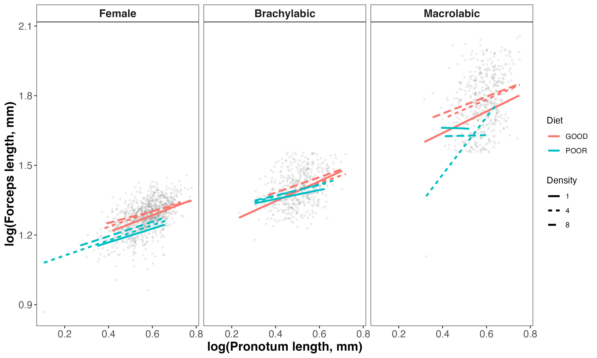

```{r echo=FALSE}
knitr::read_chunk('scripts/2026_earwig_allometry.R')
```

```{r analysis, include=FALSE,echo=FALSE, warning=FALSE, results="hide"}
```

\newpage

**Table S1.** Sample sizes for each phenotypic group, diet treatment, and density treatment. These values indicate the number of individuals contributing to each condition-specific allometric slope estimate.
```{r}
#| echo: false
#| message: false
#| warning: false

table_s1 <- dat.morphs %>%
  count(group3, diet, density, name = "n") %>%
  mutate(
    group3 = recode(group3,
                    female = "Female",
                    brachylabic = "Brachylabic male",
                    macrolabic = "Macrolabic male"),
    diet = recode(diet,
                  GOOD = "Good",
                  POOR = "Poor"),
    density = recode(density,
                     `1` = "Low",
                     `4` = "Medium",
                     `8` = "High"),
    density = factor(density, levels = c("Low", "Medium", "High")),
    group3 = factor(group3,
                    levels = c("Female", "Brachylabic male", "Macrolabic male"))
  ) %>%
  arrange(group3, diet, density) %>%
  rename(
    `Phenotypic group` = group3,
    Diet = diet,
    Density = density,
    `Sample size` = n
  )

flextable(table_s1) %>%
  fontsize(size = 10, part = "all") %>%
  autofit()
```

\newpage

**Table S2.** Posterior summaries from the unified three-group Bayesian allometry model. The model estimated log forceps length as a function of log pronotum length, phenotypic group, diet, density, and all interactions, with varying intercepts and body-size slopes for maternal identity. Values are posterior medians and 95% credible intervals.
```{r}
#| echo: false
#| message: false
#| warning: false

post <- posterior_summary(mod_all) %>%
  as.data.frame() %>%
  rownames_to_column("Parameter") %>%
  filter(!str_detect(Parameter, "lp__"))

post <- post %>%
  mutate(
    Section = case_when(
      str_detect(Parameter, "^b_") ~ "Fixed effects",
      str_detect(Parameter, "^sd_") ~ "Among-mother SD",
      str_detect(Parameter, "^cor_") ~ "Among-mother correlation",
      str_detect(Parameter, "^sigma") ~ "Residual SD",
      TRUE ~ NA_character_
    )
  ) %>%
  filter(!is.na(Section))

clean_labels_all <- function(param) {
  param <- str_replace(param, "^b_", "")

  param <- str_replace_all(param, "logP", "Body size")
  param <- str_replace_all(param, "group3brachylabic", "Brachylabic male")
  param <- str_replace_all(param, "group3macrolabic", "Macrolabic male")
  param <- str_replace_all(param, "dietPOOR", "Poor diet")
  param <- str_replace_all(param, "density4", "Density = 4")
  param <- str_replace_all(param, "density8", "Density = 8")
  param <- str_replace_all(param, ":", " × ")

  param <- str_replace(param, "^Intercept$", "Intercept")
  param <- str_replace(param, "^sd_id_mere__Intercept$", "SD: intercept")
  param <- str_replace(param, "^sd_id_mere__logP$", "SD: body-size slope")
  param <- str_replace(param, "^cor_id_mere__Intercept__logP$", "Correlation: intercept × body-size slope")
  param <- str_replace(param, "^sigma$", "Residual SD")

  param
}

table_s2 <- post %>%
  mutate(Parameter = clean_labels_all(Parameter)) %>%
  transmute(
    Section,
    Parameter,
    Estimate = round(Estimate, 2),
    `95% CrI` = paste0(round(Q2.5, 2), ", ", round(Q97.5, 2))
  ) %>%
  arrange(
    factor(
      Section,
      levels = c(
        "Fixed effects",
        "Among-mother SD",
        "Among-mother correlation",
        "Residual SD"
      )
    )
  )

flextable(table_s2) %>%
  merge_v(j = "Section") %>%
  valign(j = "Section", valign = "top") %>%
  fontsize(size = 9, part = "all") %>%
  bold(part = "header") %>%
  autofit()
```

\newpage
**Table S3.** Leave-one-out cross-validation (LOO) comparison of linear and quadratic allometry models. Both models included phenotypic group (female, brachylabic male, and macrolabic male), diet, density, body size (log pronotum length), and all interactions among predictors, with varying intercepts and body-size slopes for maternal identity. The quadratic model additionally included a squared body-size term and its interactions. Models were compared using expected log predictive density (ELPD), with larger ELPD values indicating better expected out-of-sample predictive performance. Differences in ELPD (ΔELPD) are reported relative to the best-supported model.
```{r}
#| echo: false
#| message: false
#| warning: false

loo_table_formatted <- loo_table %>%
  transmute(
    Model,
    `elpd difference` = round(elpd_diff, 2),
    SE = round(se_diff, 2)
  )

flextable(loo_table_formatted) %>%
  autofit()
```

\newpage

**Table S4.** Condition-specific allometric slopes from the unified three-group Bayesian allometry model. Slopes describe the relationship between log-transformed forceps length and log-transformed pronotum length for each phenotypic group, diet treatment, and density treatment. Values are posterior medians and 95% credible intervals.
```{r}
#| echo: false
#| message: false
#| warning: false

library(dplyr)
library(flextable)
library(emmeans)

slopes_all <- emtrends(
  mod_all,
  ~ group3 * diet * density,
  var = "logP"
)

slope_table <- as.data.frame(slopes_all)

table_s4 <- slope_table %>%
  mutate(
    group3 = recode(group3,
                    female = "Female",
                    brachylabic = "Brachylabic male",
                    macrolabic = "Macrolabic male"),
    diet = recode(diet,
                  GOOD = "Good",
                  POOR = "Poor"),
    density = recode(density,
                     `1` = "Low",
                     `4` = "Medium",
                     `8` = "High"),
    density = factor(density, levels = c("Low", "Medium", "High")),
    group3 = factor(group3,
                    levels = c("Female", "Brachylabic male", "Macrolabic male"))
  ) %>%
  arrange(group3, diet, density) %>%
  transmute(
    `Phenotypic group` = group3,
    Diet = diet,
    Density = density,
    `Allometric slope` = round(logP.trend, 2),
    `95% CrI` = paste0(round(lower.HPD, 2), ", ", round(upper.HPD, 2))
  )

flextable(table_s4) %>%
  merge_v(j = c("Phenotypic group", "Diet")) %>%
  valign(j = c("Phenotypic group", "Diet"), valign = "top") %>%
  fontsize(size = 9, part = "all") %>%
  bold(part = "header") %>%
  autofit()
```

\newpage

**Table S5.** Pairwise contrasts among phenotypic groups in allometric slope within each diet and density treatment. Contrasts were estimated from the unified three-group Bayesian allometry model using posterior distributions of condition-specific slopes. Values are posterior medians and 95% credible intervals.
```{r}
#| echo: false
#| message: false
#| warning: false

group_slope_contrasts <- pairs(
  emtrends(mod_all, ~ group3 | diet * density, var = "logP")
)

contrast_table <- as.data.frame(group_slope_contrasts)

table_s5 <- contrast_table %>%
  mutate(
    diet = recode(diet,
                  GOOD = "Good",
                  POOR = "Poor"),
    density = recode(density,
                     `1` = "Low",
                     `4` = "Medium",
                     `8` = "High"),
    density = factor(density, levels = c("Low", "Medium", "High")),
    contrast = recode(
      contrast,
      "female - brachylabic" = "Female − brachylabic male",
      "female - macrolabic" = "Female − macrolabic male",
      "brachylabic - macrolabic" = "Brachylabic male − macrolabic male"
    )
  ) %>%
  arrange(diet, density, contrast) %>%
  transmute(
    Diet = diet,
    Density = density,
    Contrast = contrast,
    `Slope difference` = round(estimate, 2),
    `95% CrI` = paste0(round(lower.HPD, 2), ", ", round(upper.HPD, 2))
  )

flextable(table_s5) %>%
  merge_v(j = c("Diet", "Density")) %>%
  valign(j = c("Diet", "Density"), valign = "top") %>%
  fontsize(size = 9, part = "all") %>%
  bold(part = "header") %>%
  autofit()
```

\newpage

::: {#fig-sone fig-cap="Relationship between pronotum length and forceps length in female, brachylabic male, and macrolabic male Forficula auricularia sensu lato. Points represent individual earwigs. Lines show fitted values from the hierarchical Bayesian allometry model for each combination of diet treatment (good versus poor) and density treatment (1, 4, or 8 individuals per dish). Females and brachylabic males exhibited broadly similar scaling relationships across environments, whereas macrolabic males showed greater divergence among treatment combinations. Note that macrolabic males were uncommon under poor-diet conditions (Table S1), and estimates for these environments should therefore be interpreted cautiously."}

